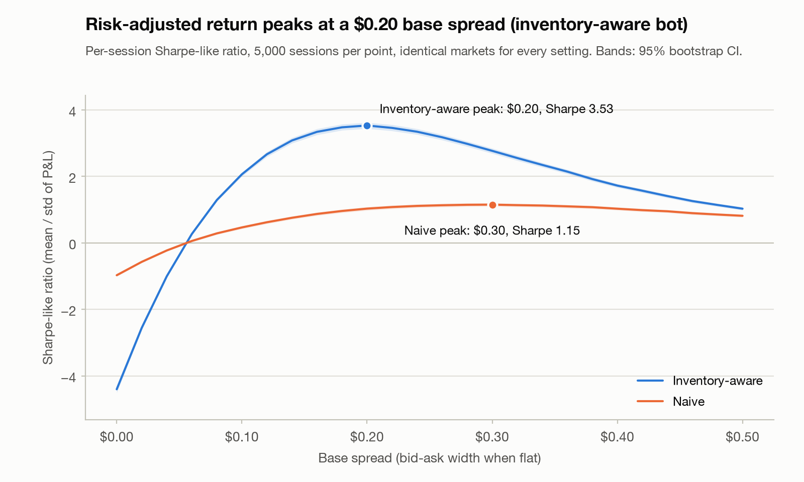
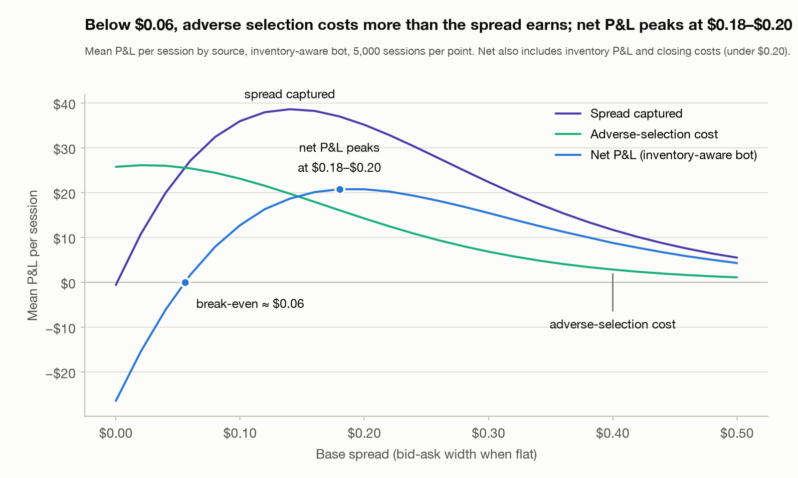
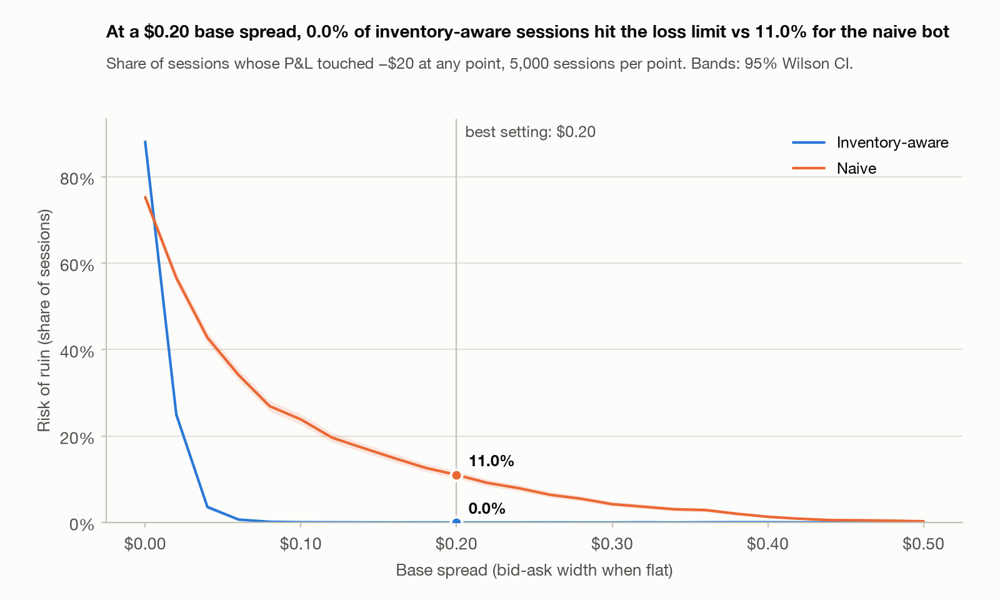
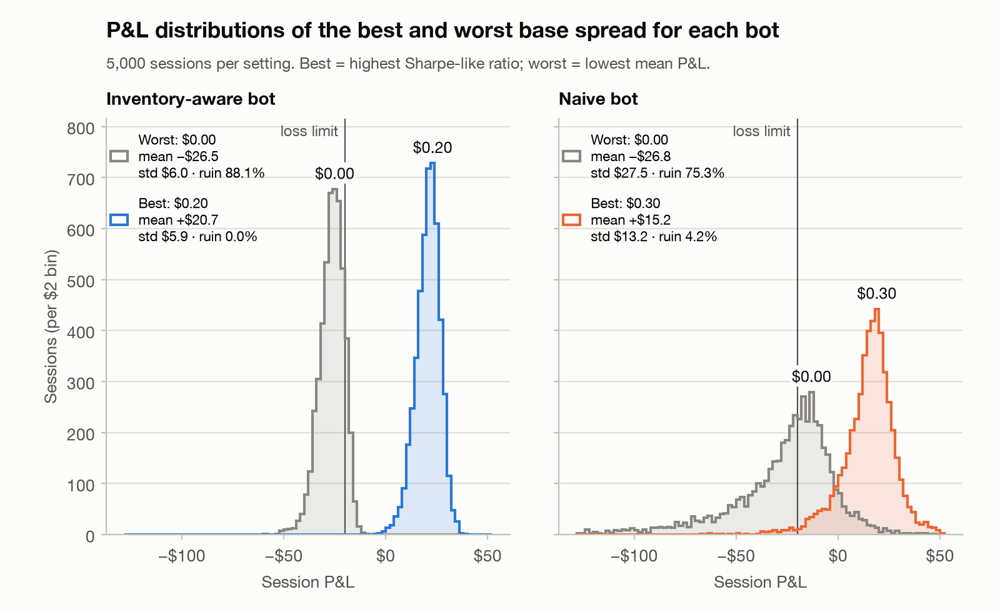
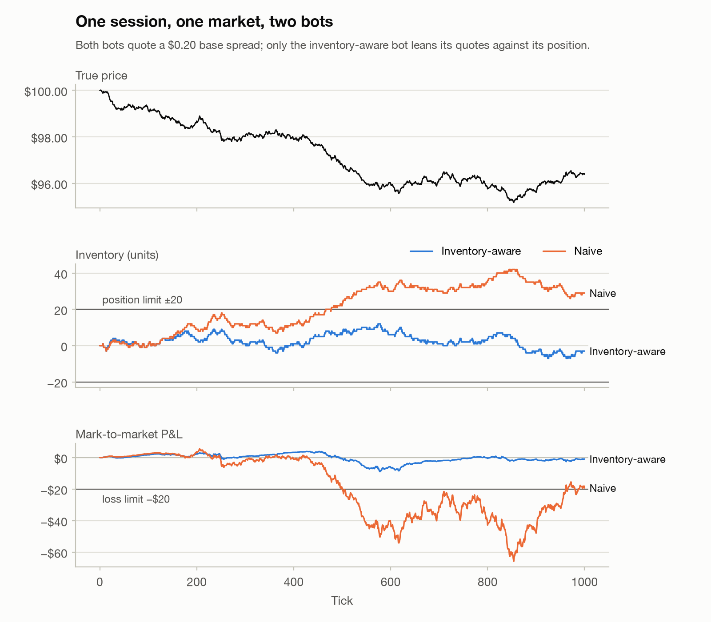

# Market-Making Strategy Evaluation via Monte Carlo

A market-making bot, a simulated market containing the two things that make market making hard
(**adverse selection** and **inventory risk**), and a Monte Carlo harness built to answer one
question with evidence rather than a lucky run: **what quoted spread is actually best, and why?**

## Result

> **With inventory-aware quoting, a $0.20 base spread maximises risk-adjusted P&L.** Across 5,000
> simulated sessions it earns **+$20.74 per session** (95% CI +$20.58 to +$20.90) with a
> Sharpe-like ratio of **3.53** (95% CI 3.44 to 3.63), and **none of the 5,000 sessions touched the
> −$20 loss limit** (risk of ruin ≤ 0.08% at 95% confidence).

Three findings explain why:

1. **Adverse selection sets a floor.** Every spread up to $0.04 loses money for both bots. At a zero
   spread the bot captures nothing and loses $25.75 per session to counterparties who trade on
   price moves it has not yet reacted to. Break-even is about $0.06.
2. **Past $0.20 the bot overcharges.** Fills fall off faster than the edge per fill grows, so mean
   P&L peaks at $0.18 to $0.20. That is where first-order theory puts it, at
   2(1/k + kσ²) = $0.20 ([derivation below](#why-the-optimum-is-where-it-is)).
3. **Inventory skew is what makes $0.20 safe.** At the same $0.20 spread, a naive bot that ignores
   its inventory earns statistically the same mean P&L (paired 95% CI for the difference: −$0.04 to
   +$0.92) with **3.4× the volatility and an 11.0% risk of ruin**. The naive bot's only risk lever is
   the spread itself: its best Sharpe comes from widening to $0.30, which gives up 25% of its
   expected P&L and still leaves a 4.2% risk of ruin.

The result holds up: across a 40× range of inventory penalties the Sharpe-maximising spread stays at
$0.18 to $0.20, and when volatility or order-flow sensitivity change, the optimum moves the way the
theory predicts ([robustness](#robustness)).



## Contents

- [What this simulates, and why](#what-this-simulates-and-why)
- [How the market maker works](#how-the-market-maker-works)
- [How the evaluation works](#how-the-evaluation-works)
- [Results in detail](#results-in-detail)
- [Why the optimum is where it is](#why-the-optimum-is-where-it-is)
- [Robustness](#robustness)
- [Running it](#running-it)
- [Dashboard](#dashboard)
- [Project layout](#project-layout)
- [Assumptions and limitations](#assumptions-and-limitations)
- [References](#references)

## What this simulates, and why

A market maker posts a bid and an ask and earns the spread when both get hit. Two forces work
against it:

- **Adverse selection.** The traders keenest to hit a quote are the ones who know it is stale, so
  the bot tends to sell just before the price rises and buy just before it falls.
- **Inventory risk.** Fills do not arrive in neat buy/sell pairs. The bot accumulates a position,
  and a position loses money when the price trends against it.

The simulation contains both in the simplest form that still behaves realistically. Each tick:

1. The bot sees the true price S<sub>t</sub> and its inventory q<sub>t</sub> and posts a bid and an ask.
2. The true price moves: S<sub>t</sub> → S<sub>t+1</sub>.
3. Counterparties see S<sub>t+1</sub> and trade against the bot's now-stale quotes.
4. Cash and inventory update, and the position is marked to market at S<sub>t+1</sub>.

At the close, leftover inventory is flattened at the true price minus $0.05 per unit.

| Component | Model | Defaults |
|---|---|---|
| True price ([`price_sim.py`](price_sim.py)) | Arithmetic random walk S<sub>t+1</sub> = S<sub>t</sub> + σZ<sub>t</sub>. Mean reversion can be switched on (discrete Ornstein–Uhlenbeck: adds κ(μ − S<sub>t</sub>)); it leaves one-tick volatility unchanged. | S<sub>0</sub> = $100, σ = $0.05 per tick, 1,000 ticks per session |
| Counterparties ([`order_flow.py`](order_flow.py)) | Buyers and sellers arrive as Poisson processes with intensity λ(d) = A·e<sup>−kd</sup>, where d is how far the quote sits on the wrong side of the true price (Avellaneda & Stoikov, 2008). A quote fills within a tick with probability 1 − e<sup>−λ</sup>, one unit at a time. | A = 1 per tick per side, k = 20 per $ |
| Bot ([`market_maker.py`](market_maker.py)) | Quotes around the reference price, optionally skewed for inventory ([below](#how-the-market-maker-works)) | base spread $0.20, γ = $0.002 per unit, position limit 20 |
| Session ([`session.py`](session.py)) | Runs the tick loop, the accounting and the risk metrics. A session is **ruined** if its P&L touches −$20 at any point. | loss limit $20 |

Adverse selection falls out of the timing: whether a quote fills depends on the price *after* the
move, but the quote was set *before* it (from `python order_flow.py`):

| The bot's ask relative to the true price | P(filled this tick) |
|---|---:|
| $0.10 above: the quoted half-spread, nothing has moved | 12.7% |
| $0.05 above: after a $0.05 up-move the bot has not reacted to | 30.8% |
| at the true price: after a $0.10 up-move | 63.2% |
| $0.05 below: after a $0.15 up-move | 93.4% |

Fills cluster exactly when they are bad for the bot.

## How the market maker works

**Naive mode** quotes symmetrically around the reference price m and ignores inventory:
bid = m − s/2, ask = m + s/2.

**Inventory-aware mode** leans its quotes against its position:

```
reservation price   r = m − γ·q          skew; γ = inventory penalty ($ per unit held)
half-spread         h = s/2 + η·|q|      optional widening; η = 0 by default
bid = r − h         ask = r + h
```

When the bot is long (q > 0), both quotes move down. The ask becomes more attractive, so the bot
sells more, and the bid less attractive, so it buys less. Inventory is pulled back towards zero,
with a half-life of about 60 ticks at the default γ. This is the stationary form of the
Avellaneda–Stoikov reservation price r = m − q·γ<sub>AS</sub>·σ²·(T − t). As a hard backstop, the bot
stops bidding at +20 units and stops offering at −20. Quotes at a $100.00 reference price with the
default $0.20 base spread (`python market_maker.py`):

| Inventory | Naive bid / ask | Inventory-aware bid / ask |
|---:|---|---|
| −20 | 99.900 / 100.100 | 99.940 / none (at the limit: no offer) |
| −10 | 99.900 / 100.100 | 99.920 / 100.120 |
| 0 | 99.900 / 100.100 | 99.900 / 100.100 |
| +10 | 99.900 / 100.100 | 99.880 / 100.080 |
| +20 | 99.900 / 100.100 | none / 100.060 (at the limit: no bid) |

**Why skew rather than widen?** Near the optimal spread, the expected P&L of a quote is flat in its
distance from the price. Moving one quote in by γq and the other out by γq therefore costs only
second-order edge, while its effect on inventory is first order. That is why skewing is almost free
in the results. Widening instead cuts fills on *both* sides, including the side that would reduce
the position. Sweeping the widening coefficient (`python sweep.py --param spread_widening --values 0
0.001 0.002 0.004 0.008 --modes inventory-aware`) confirms it: at η = $0.008 per unit, Sharpe falls
from 3.53 to 2.56 and average |inventory| *rises* from 2.9 to 3.5 units. Widening is implemented
but off by default.

## How the evaluation works

- **Monte Carlo.** Every setting is run for 5,000 independent sessions. Trial *i* gets its own seed,
  the *i*-th child of `numpy.random.SeedSequence(2026)`, so any trial can be replayed exactly on
  its own (`python session.py --replay 2026 <i>`). A test checks that replays match the batch.
- **Common random numbers.** A session's market (price path and counterparty arrivals) is drawn
  from its seed before any trading happens, so it never depends on the strategy. All 52 settings in
  the sweep (26 spreads × 2 bots) trade the *same* 5,000 markets. Differences between settings come
  from the strategy, not from luck, and comparisons can be paired session by session.
- **Metrics per setting**, each with a 95% confidence interval:

  | Metric | Definition |
  |---|---|
  | Mean P&L | Average session P&L after the closing liquidation (normal CI) |
  | Sharpe-like ratio | Mean ÷ standard deviation of session P&L (bootstrap CI, 1,000 resamples) |
  | Risk of ruin | Share of sessions whose P&L touched −$20 at any point (Wilson CI) |
  | Tail | 5th-percentile session P&L, and the mean of the worst 5% |
  | Max drawdown | Largest peak-to-trough fall in P&L within a session |
  | Fill rate / inventory | Share of quotes filled; mean \|inventory\|; share of ticks at the 20-unit limit |
  | P&L attribution | Spread capture + adverse selection + inventory P&L + closing cost, which add up exactly to P&L |

- **Choosing "best".** Best is the highest Sharpe-like ratio. Two settings count as **statistically
  tied** if the 95% paired-bootstrap interval for the difference in their Sharpe ratios includes
  zero. The same resampling plan is used for every setting, which keeps the comparison paired.
  "Worst" is the lowest mean P&L: Sharpe ratios rank losing strategies backwards, because extra
  noise makes a negative Sharpe look better.

## Results in detail

Full output: [`results/sweep_summary.txt`](results/sweep_summary.txt); every metric with its CI:
[`results/sweep_results.csv`](results/sweep_results.csv). Selected rows:

| Base spread | Aware: mean P&L | Aware: std | Aware: Sharpe | Aware: ruin | Naive: mean P&L | Naive: std | Naive: Sharpe | Naive: ruin |
|---:|---:|---:|---:|---:|---:|---:|---:|---:|
| $0.00 | −$26.47 | $6.01 | −4.40 | 88.1% | −$26.78 | $27.54 | −0.97 | 75.3% |
| $0.04 | −$6.15 | $6.13 | −1.00 | 3.6% | −$6.34 | $27.97 | −0.23 | 42.8% |
| $0.06 | +$1.66 | $6.18 | 0.27 | 0.7% | +$1.64 | $27.77 | 0.06 | 34.1% |
| $0.10 | +$12.72 | $6.16 | 2.07 | 0.1% | +$12.52 | $26.82 | 0.47 | 23.9% |
| $0.14 | +$18.64 | $6.04 | 3.08 | 0.0% | +$18.24 | $24.10 | 0.76 | 17.2% |
| $0.18 | +$20.74 | $5.96 | 3.48 | 0.0% | +$20.26 | $21.07 | 0.96 | 12.7% |
| **$0.20** | **+$20.74** | **$5.87** | **3.53** | **0.0%** | +$20.30 | $19.66 | 1.03 | 11.0% |
| $0.22 | +$20.24 | $5.85 | 3.46 | 0.0% | +$19.68 | $18.23 | 1.08 | 9.2% |
| $0.30 | +$15.45 | $5.57 | 2.77 | 0.0% | +$15.20 | $13.19 | **1.15** | 4.2% |
| $0.40 | +$8.77 | $5.08 | 1.73 | 0.1% | +$8.60 | $8.35 | 1.03 | 1.3% |
| $0.50 | +$4.28 | $4.15 | 1.03 | 0.1% | +$4.24 | $5.19 | 0.82 | 0.3% |

**The optimum is sharp statistically and flat economically.** Because every setting trades the same
markets, paired comparisons are precise: both neighbours of $0.20 have a significantly lower
Sharpe. The differences are small, though. Every spread from $0.18 to $0.22 is within 5% of the
best Sharpe, so a trader would treat that whole range as the optimum.

**Why narrow spreads lose and wide spreads earn little.** The attribution below splits mean P&L by
source. Spread captured rises and then falls as the spread widens (edge per fill × number of
fills). The adverse-selection cost falls steadily. Below about $0.06 the cost exceeds the capture.
At $0.20, adverse selection still gives back 41% of the $35.12 captured.



**Risk of ruin falls with the spread for both bots, but only inventory skew removes it at the
spread that maximises P&L.** At $0.20 the naive bot hits the loss limit in 11.0% of sessions and
spends 12.7% of its time at or beyond the 20-unit limit. The inventory-aware bot does neither.
(At a zero spread the naive bot is ruined *less* often, 75% vs 88%. Both lose about $26 on average,
and the naive bot's extra volatility lets a quarter of its sessions escape by luck.)



**The whole distribution moves, not just the average.** Best vs worst spread for each bot. At its
best, the inventory-aware bot's worst 5% of sessions still average +$6.97; the naive bot's worst 5%
at $0.20 average −$34.29.



**One session, for intuition only.** Seed 7 happens to be a trend day: the price falls from $100.00
to $96.39, a 2.3σ move. The naive bot keeps buying into the decline, peaks at +42 units, draws down
to −$65.80 and closes at −$20.73. On the same market the inventory-aware bot stays between −7 and
+12 units and closes at −$1.07. A single session is an anecdote, which is why everything above uses
5,000 of them.



## Why the optimum is where it is

Take the ask at distance δ above the price. During the tick the price moves by σZ, so the ask
ends up δ − σZ from the price the counterparties see. When fill probabilities are small
(P ≈ λ), the expected P&L of the ask per tick is

```
E[λ(δ − σZ)·(δ − σZ)] = A·e^(−kδ)·e^(k²σ²/2)·(δ − kσ²)
```

using E[e<sup>aZ</sup>] = e<sup>a²/2</sup> and E[Z·e<sup>aZ</sup>] = a·e<sup>a²/2</sup>. Two facts follow:

- **Break-even half-spread = kσ²**, the adverse-selection premium: a quote must at least cover
  the average move against the fills it attracts.
- **Mean-P&L-maximising half-spread = 1/k + kσ²**: a markup set by how price-sensitive the flow is
  (1/k), plus the adverse-selection premium.

For the naive bot, P&L risk is dominated by inventory, a random walk whose variance grows with the
fill rate (∝ e<sup>−kδ</sup>). So its Sharpe ∝ e<sup>−kδ/2</sup>(δ − kσ²), which peaks further out
at δ = 2/k + kσ². This is the roughest of the approximations, since it ignores fill saturation and
the non-inventory parts of the variance. The inventory-aware bot keeps its inventory small whatever
the spread, so its P&L std is almost flat in δ and its Sharpe peaks where its mean does.

With k = 20 per $ and σ = $0.05, both 1/k and kσ² equal $0.05. Full spreads (2δ):

| | First-order theory | Simulation |
|---|---:|---:|
| Break-even spread | 2kσ² = $0.10 | ≈ $0.06 |
| Mean-P&L-maximising spread | 2(1/k + kσ²) = $0.20 | $0.18 to $0.20 (statistically tied) |
| Sharpe-maximising spread, naive bot | 2(2/k + kσ²) = $0.30 | $0.30 (tied $0.24 to $0.34) |
| Sharpe-maximising spread, inventory-aware bot | = mean-maximising, $0.20 | $0.20 |

The break-even is lower in simulation than in theory because the fill probability saturates at 1:
a stale quote can be picked off at most once per tick. That caps losses on large adverse moves,
which the linear approximation P ≈ λ overcounts at narrow spreads.

## Robustness

Is $0.20 an artifact of the defaults? [`robustness.py`](robustness.py) re-runs the full spread sweep
(5,000 sessions per setting) while varying the inventory penalty and the market
([`results/robustness.csv`](results/robustness.csv)).

**The optimal spread does not depend on the inventory penalty.** γ acts as a separate risk dial:
stronger skew buys a lot of variance reduction for a little expected P&L.

| γ ($ per unit) | Sharpe-optimal spread | Sharpe | Mean P&L | Std |
|---:|---:|---:|---:|---:|
| 0.0005 | $0.20 | 1.98 | +$20.73 | $10.48 |
| 0.001 | $0.20 | 2.62 | +$20.76 | $7.93 |
| **0.002** (default) | **$0.20** | **3.53** | **+$20.74** | **$5.87** |
| 0.005 | $0.20 | 5.20 | +$20.55 | $3.95 |
| 0.01 | $0.18 | 6.87 | +$20.07 | $2.92 |
| 0.02 | $0.20 | 8.68 | +$19.42 | $2.24 |

**The optimum moves with the market the way theory says it should.** A wider spread is needed when
volatility is higher (a bigger adverse-selection premium kσ²) or when flow is less price-sensitive
(a bigger markup 1/k).

| σ ($/tick) | k (per $) | kσ | Predicted mean-optimal spread | Simulated (statistically tied) | Sharpe-optimal |
|---:|---:|---:|---:|---:|---:|
| 0.03 | 20 | 0.60 | $0.136 | $0.14 | $0.14 |
| 0.05 | 10 | 0.50 | $0.250 | $0.26 to $0.28 | $0.26 |
| 0.08 | 12 | 0.96 | $0.320 | $0.30 to $0.32 | $0.32 |
| **0.05** | **20** | **1.00** | **$0.200** | **$0.18 to $0.20** | **$0.20** |
| 0.07 | 20 | 1.40 | $0.296 | $0.24 to $0.26 | $0.26 |
| 0.05 | 30 | 1.50 | $0.217 | $0.18 | $0.18 |

The approximation holds when kσ ≤ 1, meaning a one-σ move changes the fill intensity by less than a
factor of e. Beyond that it overstates the adverse-selection premium for the same saturation reason
as the break-even point, so the true optimum is somewhat tighter than predicted.

## Running it

Requires Python 3.10+.

```bash
python -m venv .venv && source .venv/bin/activate
pip install -r requirements.txt
python sweep.py --trials 5000       # the main result: 260,000 sessions, ~15 s; writes results/
pytest                              # sanity tests, ~1 s
```

Each module also runs on its own, which is a quick way to see each stage:

```bash
python price_sim.py                 # simulated volatility vs theory, with and without mean reversion
python order_flow.py                # the fill-probability curve and the adverse-selection effect
python market_maker.py              # quotes at different inventory levels, both modes
python session.py --seed 7 --plot results/example_session.png   # one session, both bots
python monte_carlo.py --trials 5000 # outcome distribution for one strategy (try --naive, --spread)
python robustness.py --trials 5000  # the robustness tables above, ~2 min
python sweep.py --param inventory_penalty   # sweep a different strategy parameter
```

There is also a local dashboard for exploring the model interactively; see
[Dashboard](#dashboard).

`sweep.py` accepts `--param` (`base_spread`, `inventory_penalty`, `spread_widening`,
`max_inventory`), `--values`, `--modes`, `--seed` and `--out`. Results are deterministic for a given
seed. The committed results were generated with Python 3.14, numpy 2.5.3 and matplotlib 3.11.2.
numpy does not guarantee identical normal-variate streams across versions, so other versions may
differ in the last digits; the conclusions do not change.

The sanity tests check the economics (a zero spread loses money through adverse selection, wider
spreads fill less often, zero volatility gives pure spread capture, P&L attribution adds up), the
strategy (quotes skew against inventory, the position limit is never exceeded, skew reduces risk)
and reproducibility (every Monte Carlo trial replays exactly, results do not depend on batch size).
Each was checked by deliberately breaking the corresponding piece of the model and confirming that
the test fails.

## Dashboard

A local dashboard drives the same engine, for poking at the model without editing code:

```bash
pip install -r requirements-dashboard.txt
```
```bash
streamlit run dashboard.py
```

It opens at http://localhost:8501 with the market and strategy settings in the sidebar
(volatility, mean reversion, order-flow parameters, base spread, inventory penalty, widening,
position limit, loss limit) and three tabs:

- **One session:** one market traded by both bots side by side, with the price, inventory and P&L
  chart and a per-bot breakdown of where the P&L came from.
- **Monte Carlo:** thousands of sessions per bot at the current settings. Mean P&L, Sharpe-like
  ratio and risk of ruin with confidence intervals, plus the two P&L distributions.
- **Spread sweep:** the full sweep over a spread range you choose, with the same charts and the
  same written findings the command line produces, and the theoretical optimum for comparison.

Nothing is re-implemented for the dashboard: it calls `session.py`, `monte_carlo.py` and
`sweep.py` and shows the charts from `plots.py`, so at the default settings and seed it
reproduces the numbers above exactly. Results are cached, so moving a slider back and forth is
instant.

## Project layout

| File | Purpose |
|---|---|
| [`price_sim.py`](price_sim.py) | True-price process: random walk, optional mean reversion |
| [`order_flow.py`](order_flow.py) | Counterparty arrivals and fill probabilities |
| [`market_maker.py`](market_maker.py) | The quoting policy: naive and inventory-aware modes |
| [`session.py`](session.py) | One session tick by tick; accounting, risk metrics, P&L attribution |
| [`monte_carlo.py`](monte_carlo.py) | Thousands of seeded sessions; distribution statistics and CIs |
| [`sweep.py`](sweep.py) | Parameter sweep, paired statistics, findings, CSV |
| [`plots.py`](plots.py) | All charts |
| [`robustness.py`](robustness.py) | Re-runs the sweep across inventory penalties and market conditions |
| [`dashboard.py`](dashboard.py) | Local Streamlit dashboard over the same engine |
| [`tests/test_sanity.py`](tests/test_sanity.py) | Sanity tests |
| [`results/`](results) | Generated charts, tables and summaries |

The engine is vectorised across sessions: it steps through time once and updates a whole batch of
independent sessions with numpy on each tick. A single session is a batch of one, so `run_session`
and the Monte Carlo share one code path.

## Assumptions and limitations

This is a stylised model built to isolate the spread trade-off, not a calibrated simulator of a
real market.

- **Absolute numbers are illustrative.** The parameters are not calibrated to any instrument, and
  there are no fees, rebates, queue priority or competing market makers. Relative comparisons are
  the point; per-session Sharpe ratios of 3.5 would not survive contact with a real market.
- **Information is one tick deep.** Counterparties know only the current tick's move, so adverse
  selection is fully realised within the tick. Real informed flow often predicts moves further
  ahead, which makes inventory more costly and would give skewing a cost in expected P&L, not
  only a benefit in variance.
- **Order flow is exogenous.** The bot's trades do not move the true price, and counterparties do
  not react to its past behaviour. Every trade is one unit, with at most one fill per side per tick.
- **Ruin is measured, not enforced.** A session keeps trading after touching the loss limit, so the
  P&L distributions show the unconstrained tail. A real risk desk would have stopped the bot.
- **The skew is stationary.** Avellaneda–Stoikov's time-dependent skew, and the optimal spread
  from their model, are natural next steps, as are persistent informed flow, price jumps, and
  optimising the spread and γ jointly.

## References

- Avellaneda, M. and Stoikov, S. (2008). High-frequency trading in a limit order book.
  *Quantitative Finance*, 8(3), 217–224.
- Glosten, L. R. and Milgrom, P. R. (1985). Bid, ask and transaction prices in a specialist market
  with heterogeneously informed traders. *Journal of Financial Economics*, 14(1), 71–100.
- Guéant, O., Lehalle, C.-A. and Fernandez-Tapia, J. (2013). Dealing with the inventory risk: a
  solution to the market making problem. *Mathematics and Financial Economics*, 7(4), 477–507.

## License

MIT. See [LICENSE](LICENSE).
